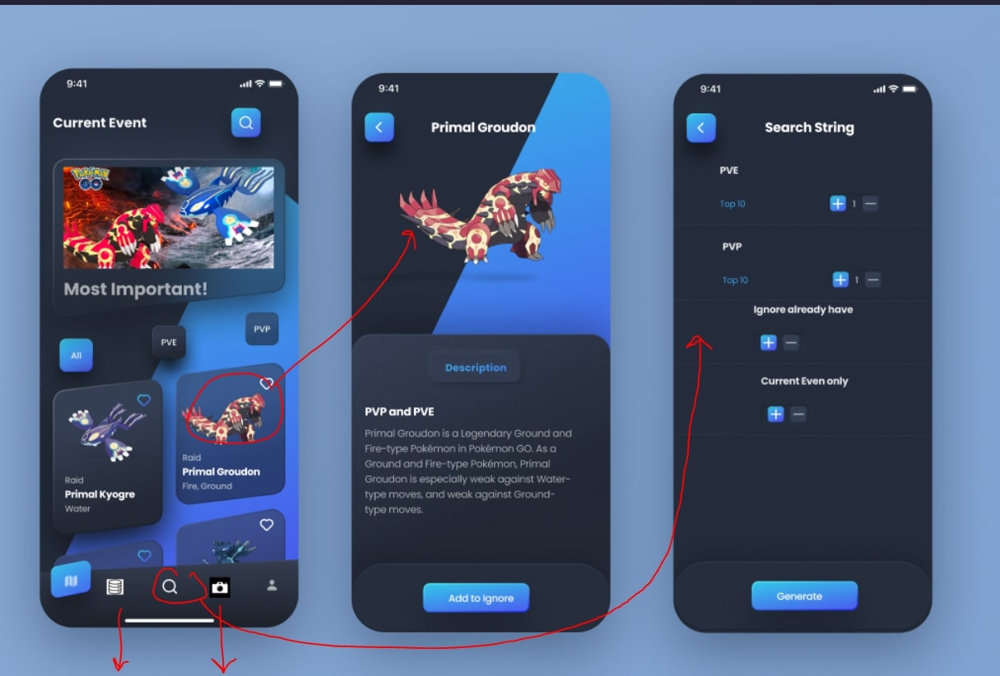
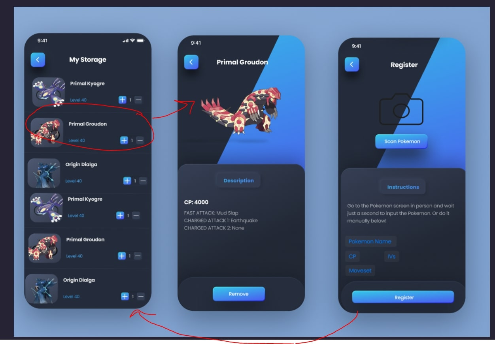
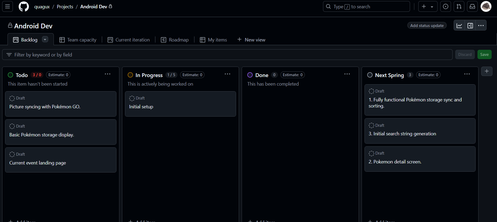
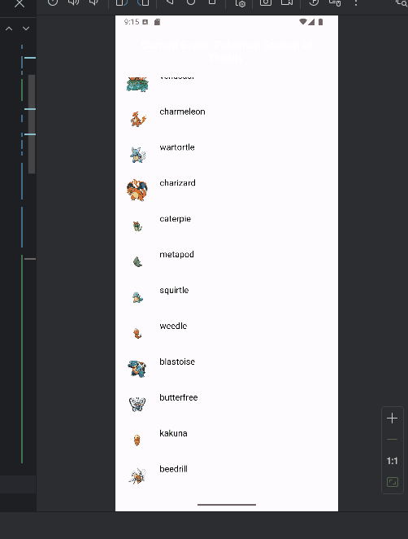
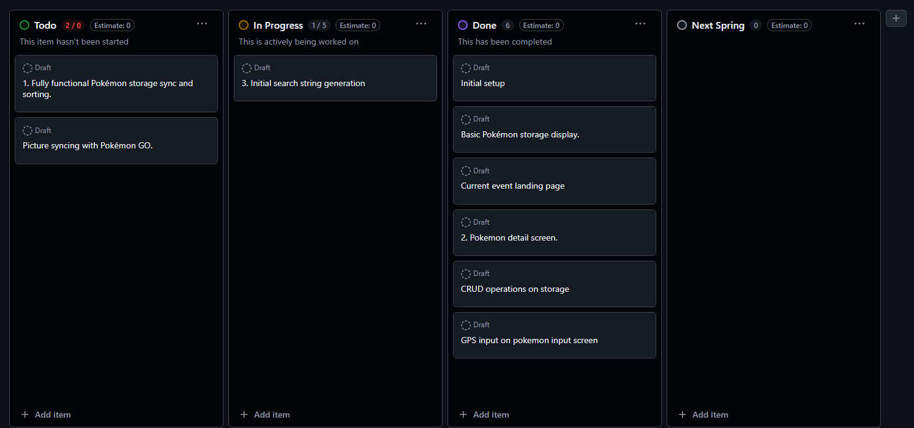
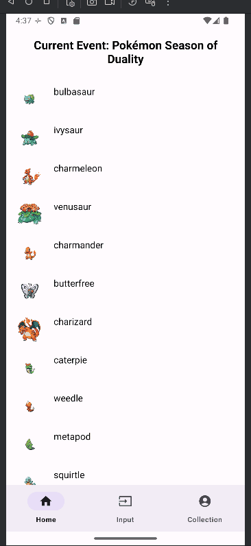

 ([CLASS REQUIRMENTS](requirements.md ))

# Milestone 1 - Pokémon GO PC Manager (Unit 7)  

## Table of Contents  

1. [Overview](#Overview)  
1. [Product Spec](#Product-Spec)  
1. [Wireframes](#Wireframes)  

## Overview  

### Description  

Pokémon GO PC Manager is a desktop companion app that syncs with the Pokémon GO mobile app. It provides a user-friendly interface for managing Pokémon storage, sorting items, and strategizing for battles, trades, and events.  

### App Evaluation  

- **Category:** Companion App / Utilities  
- **Mobile:** Syncs with the Pokémon GO mobile app for real-time updates and seamless data transfer.  
- **Story:** Helps Trainers streamline their gameplay experience by offering a more efficient way to manage Pokémon, items, and battle teams.  
- **Market:** Targeted at hardcore Pokémon GO players who need advanced tools to manage large inventories and plan strategies.  
- **Habit:** Regularly used for event preparation, post-event organization, and team-building. Integration with live sync features encourages consistent engagement.  
- **Scope:**  
  - V1: Basic Pokémon management features.  
  - V2: Advanced filters, search string generation, and categorization tools.  
  - V3: Event overview that highlights the important Pokémon to focus on.  

---

## Product Spec  

### 1. User Features (Required and Optional)  

**Required Features**  
1. View and sort owned Pokémon by CP, level, and name.  
2. Input page for owned Pokémon.
3. Event overview and list of all Pokémon.  

**Optional Features**  
1. Export collection data.  
2. Notifications for synced events, including upcoming raids or tasks.  
3. Integration with GPS for logging when inputting Pokémon.
4. Pokemon detail page.

---

### 2. Screen Archetypes  

- **Home Dashboard**  
  - Display an overview of current event and all Pokémon.  

- **Pokémon Storage Screen**  
  - View, sort, and manage Pokémon with filters for type, CP, more.  
  - Access all other screens via nav bar.  

- **Insert Pokémon**  
  - Create and save Pokémon for personal colletion.  
  - Toggle parameter to allow GPS tracking for to tag Pokémon with location.  
  - Access all other screens via nav bar.

- **Pokémon Details**
  - View more Pokémon information
  - Accesible by clicking on Pokémon in both personal collection and home screen  

---

### 3. Navigation  

**Tab Navigation** (Tab to Screen)  
- **Dashboard:** Overview of current event and notifications.  
- **Storage:** Pokémon collection.  
- **Input Pokémon Screen:** Insert Pokémon.  
- **Pokémon Detail Screen:** View more information about Pokémon.  

**Flow Navigation** (Screen to Screen)  
- Dashboard  
  - Navigate to Storage, Input, or Details.  
- Storage  
  - Navigate details or input.  
- Input  
  - Save a Pokémon.
- Detail
  - Details of a Pokémon.

---

## Wireframes  

---

# Milestone 2 - Build Sprint 1 (Unit 8)  

## GitHub Project Board  

  

## Issue Cards  

-   

## Issues Worked On This Sprint  

- Listed issues:
  - Initial setup (DONE)
  - Firebase setup and integration (DONE)
  - Basic Pokémon storage display (DONE)
  - Current event landing page (DONE)

- GIF showing build progress:  
  

---

# Milestone 3 - Build Sprint 2 (Unit 9)  

## GitHub Project Board  

  

## Completed User Stories  

- List of completed stories:  
**Required Features**  
1. View and sort owned Pokémon by CP, level, and name (DONE)
2. Input page for owned Pokémon (DONE)
3. Event overview and list of all Pokémon (DONE)

**Optional Features**  
1. Integration with GPS for logging when inputting Pokémon (DONE)
2. Pokemon detail page (DONE)

    
- Video/GIF of current application:  
  

---

## App Demo Video  

Embed the YouTube/Vimeo link of your completed demo video here.  
https://www.youtube.com/watch?v=qQg4bqOzPuw)
